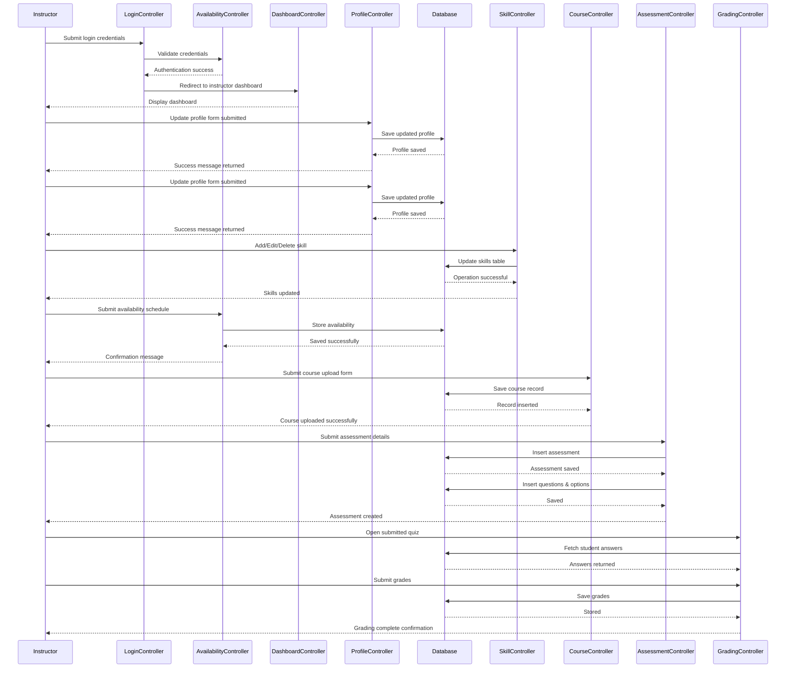

```mermaid
sequenceDiagram
    participant I as Instructor
    participant L as LoginController
    participant A as AuthSystem
    participant D as DashboardController

    I->>L: Submit login credentials
    L->>A: Validate credentials
    A-->>L: Authentication success
    L->>D: Redirect to instructor dashboard
    D-->>I: Display dashboard


    participant I as Instructor
    participant P as ProfileController
    participant DB as Database

    I->>P: Update profile form submitted
    P->>DB: Save updated profile
    DB-->>P: Profile saved
    P-->>I: Success message returned

    participant I as Instructor
    participant P as ProfileController
    participant DB as Database

    I->>P: Update profile form submitted
    P->>DB: Save updated profile
    DB-->>P: Profile saved
    P-->>I: Success message returned

    participant I as Instructor
    participant S as SkillController
    participant DB as Database

    I->>S: Add/Edit/Delete skill
    S->>DB: Update skills table
    DB-->>S: Operation successful
    S-->>I: Skills updated

    participant I as Instructor
    participant A as AvailabilityController
    participant DB as Database

    I->>A: Submit availability schedule
    A->>DB: Store availability
    DB-->>A: Saved successfully
    A-->>I: Confirmation message

    participant I as Instructor
    participant C as CourseController
    participant DB as Database

    I->>C: Submit course upload form
    C->>DB: Save course record
    DB-->>C: Record inserted
    C-->>I: Course uploaded successfully

    participant I as Instructor
    participant AC as AssessmentController
    participant DB as Database

    I->>AC: Submit assessment details
    AC->>DB: Insert assessment
    DB-->>AC: Assessment saved
    AC->>DB: Insert questions & options
    DB-->>AC: Saved
    AC-->>I: Assessment created

    participant I as Instructor
    participant G as GradingController
    participant DB as Database

    I->>G: Open submitted quiz
    G->>DB: Fetch student answers
    DB-->>G: Answers returned
    I->>G: Submit grades
    G->>DB: Save grades
    DB-->>G: Stored
    G-->>I: Grading complete confirmation
```